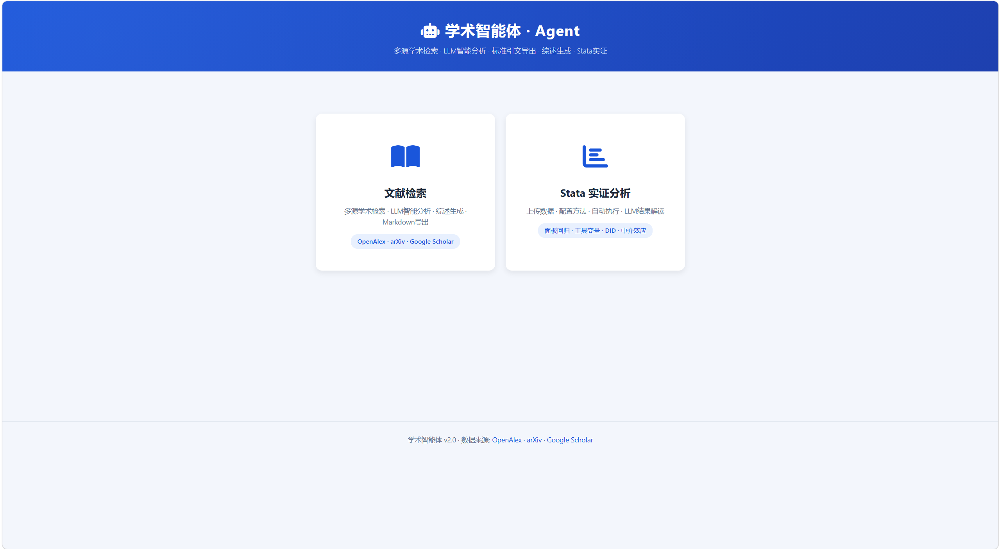
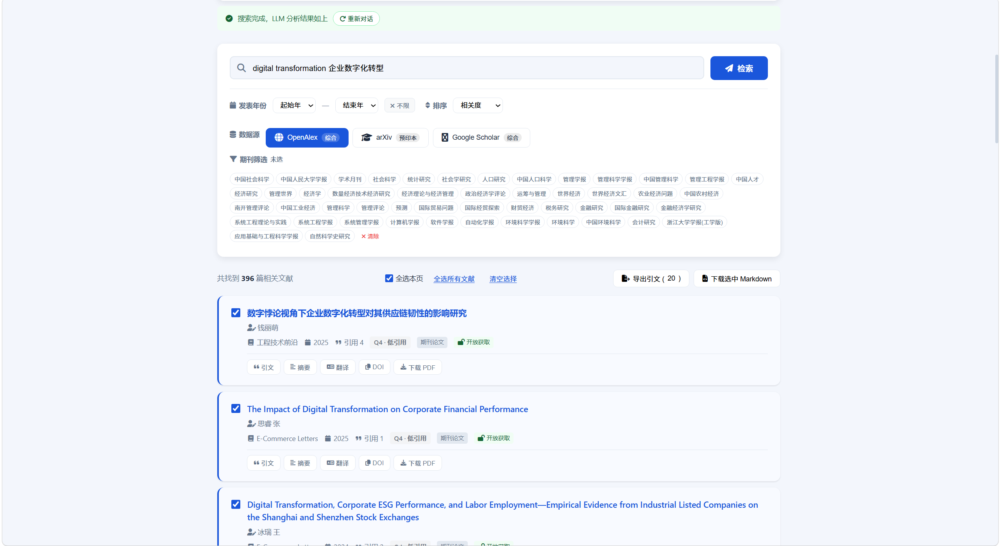

# Academic Agent · 学术智能体

> 面向经管社科研究场景的一站式学术工作台：**文献检索 → 文献综述 → Stata 实证分析 → LLM 结果解读 → 论文导出**




## 项目简介

Academic Agent 不是一个“泛聊天机器人”，而是一个围绕 **论文研究流程** 设计的垂直型学术智能体产品。

它面向的核心用户是：
- 经济学、管理学、社会学等经管社科方向学生
- 需要完成课程论文、毕业论文、实证研究的研究者
- 想把“找文献 + 跑回归 + 写结果分析”串成一条完整链路的人

这个项目要解决的不是单点问题，而是研究流程里的连续断点：
- **文献检索分散**：用户需要在多个数据库来回切换
- **综述整理耗时**：找到文献后还要手工归纳研究脉络
- **Stata 使用门槛高**：变量选择、方法配置、命令执行容易出错
- **结果不会解释**：回归跑完后还要再手工写论文中的“结果分析”部分

Academic Agent 的定位很明确：

> **把经管社科研究中的“检索—分析—解释—导出”做成一个可交互、可演示、可落地的产品化工作台。**

---

## 核心能力

### 1. 首页 / 模块入口


- 首页提供两个明确入口：**文献检索** 与 **Stata 实证分析**
- 用户一进入系统就能理解产品的双主线能力，而不是先面对一堆零散按钮
- 适合作为答辩、演示、作品集中的“产品总览页”

---

### 2. 文献检索对话入口


- 提供聊天式研究需求输入
- 支持通过自然语言触发文献检索、关键词扩展、结果筛选
- 更像“学术研究助理”而不是传统数据库检索框

这个模块强调的是：
**先用对话帮助用户明确研究方向，再进入正式检索。**

---

### 3. Stata 配置工作台


- 上传 CSV / Excel 数据文件
- 配置因变量、自变量、中介变量、控制变量
- 选择实证方法与运行模式
- 支持单模型和排列组合遍历

这个页面体现的是：

> 把传统 Stata 的命令式使用方式，转成更接近产品化表单配置的交互流程。

---

### 4. 组合结果 + Interpret 调试状态


- 展示组合遍历后的模型结果表
- 展示 **Interpret 调试状态**
- 明确告诉用户：
  - 有没有拿到可解析的系数表
  - 是否已经准备请求 `/api/stata/interpret`
  - interpret 是否成功返回

这一页的价值在于：

> 它把“黑箱的 AI 调用过程”变成了可观测、可调试、可解释的产品能力。

---

### 5. LLM 结果解读区


- Stata 执行完成后自动触发解释链路
- 自动输出：
  - 核心发现
  - 经济显著性
  - 创新点
  - 论文章节草稿
- 直接服务于“把回归结果转成论文可写内容”这一真实需求

这一点对论文用户最关键：

> 项目的目标不是“只把回归跑完”，而是让结果进一步转化为可写进论文正文的解释文本。

---

## 这次版本重点更新

### ✅ LLM 接入稳定化
- 统一读取 `LLM_API_KEY / OPENAI_API_KEY / CARAGENT_LLM_API_KEY`
- 兼容 Windows Machine / User 环境变量
- 默认接入 DeepSeek 官方：`https://api.deepseek.com/v1`
- 默认模型更新为 `deepseek-v4-flash`
- 新增 `start.py` 统一启动入口

### ✅ Stata 执行链路修复
- 修复单模型模式下 log 文件名错位导致的结果丢失问题
- 修复组合模式下最佳模型结果无法进入解释链的问题
- 修复 `xtreg / xtreg_re / ivreg2 / reghdfe` 的命令映射，确保不是“假执行”
- 自动识别常见面板变量与时间变量（如 `code / id / year`）

### ✅ 前端状态管理修复
- 修复 Literature → Home → Stata 切换后的页面残留问题
- 文献搜索结果区与分析区退出后会正确隐藏
- 避免模块污染造成“看起来像跳错页面”的问题

### ✅ 解释链路可观测性增强
- 增加 **Interpret 调试提示区**
- 明确展示：未触发 / 请求中 / 成功 / 失败 / 异常
- 降低排错成本，避免“看起来没输出但不知道卡在哪里”

### ✅ OpenAlex 限流提示优化
- 区分：
  - 短期限流
  - 当日额度耗尽
- 前端增加搜索冷却提示
- 避免把上游预算耗尽误判成“用户点太快”

---

## 产品价值概括

如果把这个项目当作品集来看，它体现的是三层能力：

### 产品层
- 不是工具脚本堆砌，而是围绕用户流程设计的模块化工作台
- 明确服务于“论文研究流程”这一垂直场景
- 支持可视化、结果导出、解释生成，具备完整产品路径

### 工程层
- FastAPI + 单页前端架构
- LangChain Agent 与 OpenAI-compatible LLM 接入
- WSL → PowerShell → Windows Stata 的跨环境桥接
- 前后端状态管理、接口联动、日志解析、错误提示的系统化修复

### 应用层
- 真正面向经管社科用户，而不是停留在技术 demo
- 可用于课程论文、毕业论文、实证研究工作流演示
- 更适合作为“AI PM / AI 产品 / 学术智能体方向”的项目展示案例

---

## 技术架构

```text
Frontend (Vanilla HTML/CSS/JS + ECharts)
        ↓
FastAPI Backend
        ↓
├─ OpenAlex / arXiv / Google Scholar mirror
├─ LangChain Agent + DeepSeek/OpenAI-compatible LLM
└─ WSL → PowerShell → Windows Stata/MP
```

### 技术栈
- **Frontend**: Vanilla HTML / CSS / JS + ECharts
- **Backend**: FastAPI + httpx
- **Agent**: LangChain
- **LLM**: OpenAI-compatible API（DeepSeek / OpenAI / SiliconFlow）
- **Academic Sources**: OpenAlex / arXiv
- **Empirical Engine**: Windows Stata/MP via WSL bridge

---

## 快速启动

### 1. 安装依赖

```bash
git clone https://github.com/Fu-uan/academic-agent.git
cd academic-agent
python -m venv venv
source venv/bin/activate
pip install -r requirements.txt
```

### 2. 配置 LLM

以 DeepSeek 为例：

```bash
export LLM_API_KEY="sk-your-key"
export LLM_BASE_URL="https://api.deepseek.com/v1"
export LLM_MODEL="deepseek-v4-flash"
```

### 3. 启动项目

推荐：

```bash
python3 start.py
```

或：

```bash
python -m uvicorn app:app --host 0.0.0.0 --port 8080
```

浏览器打开：

```text
http://localhost:8080
```

---

## 适合展示的使用场景

- **毕业论文答辩前演示**：展示从检索到实证再到解释的闭环
- **AI 产品经理作品集项目**：体现产品设计与工程落地能力
- **学术智能体方向案例**：体现“垂直场景 Agent”如何进入真实工作流
- **实证研究辅助工具演示**：突出 Stata 自动化与结果解释能力

---

## 项目结构

```text
academic-agent/
├── app.py                 # FastAPI backend
├── agent_setup.py         # LangChain Agent setup
├── start.py               # startup bootstrap for provider/env loading
├── static/
│   └── index.html         # SPA frontend
├── docs/
│   ├── screenshots/       # product screenshots
│   └── release-v1.1.0.md  # release note draft
├── requirements.txt
└── README.md
```

---

## License

MIT
