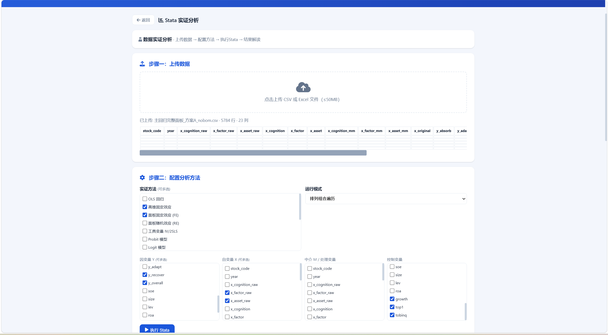
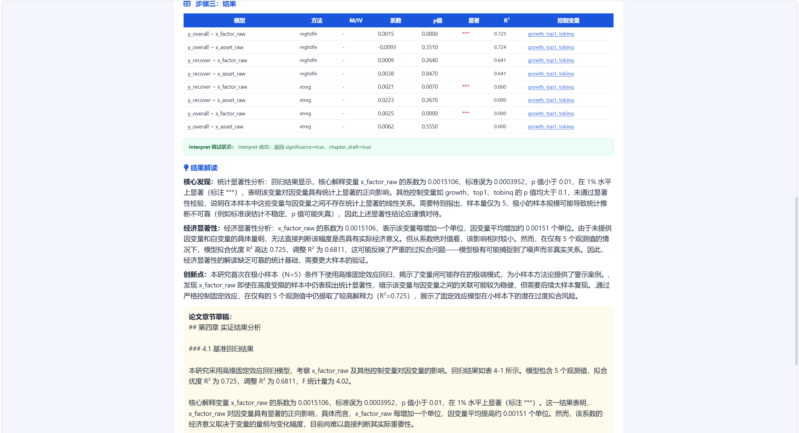
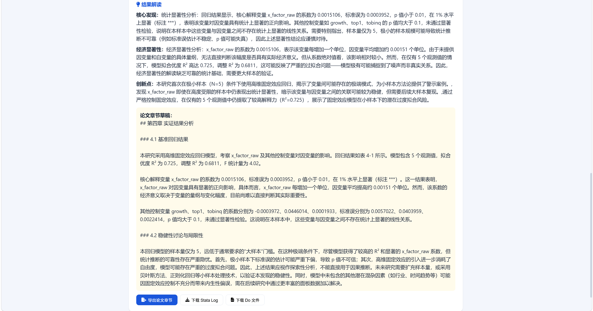
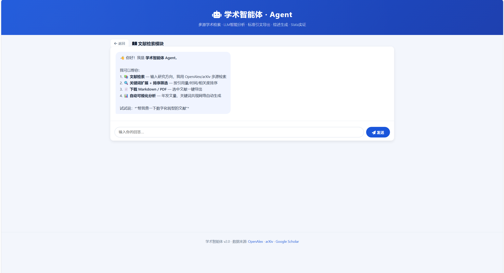

# Academic Agent · 学术智能体

> Multi-source academic literature search · LLM-powered analysis · Stata regression integration · Markdown/PDF export

面向经济学、管理学、社会学等 **经管社科** 领域的高校本硕博学生与研究者，覆盖论文研究全流程的一站式学术辅助系统。

> **核心定位**：经管社科实证研究工具链——文献检索 → 计量分析(Stata) → 结果解读 → 论文导出

---

## Features

### 📚 Literature Search
- **Multi-source**: OpenAlex API + arXiv API + Google Scholar (mirror)
- **Agent Chat**: LangChain Agent driven, understand research needs in natural language, auto-extract keywords, multi-round search
- **Filters**: Year range, 50+ Chinese core journals (multi-select), sort by relevance/citations/date
- **Paper Cards**: Title, authors, year, journal, citations, DOI links, expandable abstract
- **Safer state switching**: Literature / Home / Stata module switching now properly clears residual result panels and loading states
- **Rate-limit UX**: Frontend now exposes throttling hints and distinguishes short-term throttling from OpenAlex daily-budget exhaustion

### 📄 Export
- **Download PDF**: Intelligent fallback (arXiv → OA link → DOI page)
- **Download Markdown**: Selected papers → `.md` file with title/authors/abstract/DOI
- **Citations**: GB/T 7714 format, single or batch export

### 📊 Auto Visualization
- Yearly publication trend · Keyword co-occurrence network · Timeline · Sankey diagram
- Cold-start in background, no page blocking

### 🔬 Stata Empirical Analysis
- Upload CSV/Excel → configure Y/X/controls → auto-execute regression
- **15+ methods**: OLS, Fixed Effects (FE/RE), IV/2SLS, Probit, Logit, Tobit, DID, Mediation, PSM, etc.
- **Combination traversal**: multiple Y × multiple X × multiple methods × multiple control groups
- **Local Stata**: WSL → PowerShell bridge to Windows Stata/MP
- **Auto interpretation**: Stata completion now automatically triggers result interpretation for both single-model and combination modes
- **Interpret debug panel**: explicit frontend status area shows whether interpret was skipped, requested, succeeded, or failed

---

## Recent Updates

### ✅ LLM / provider integration
- Unified provider loading from `LLM_API_KEY`, `OPENAI_API_KEY`, `CARAGENT_LLM_API_KEY`, and Windows Machine/User environment variables
- Defaulted DeepSeek official endpoint to `https://api.deepseek.com/v1`
- Updated default model to `deepseek-v4-flash`
- Added `start.py` startup helper to bootstrap env vars before launching FastAPI

### ✅ Stata execution and interpretation chain
- Fixed single-model log naming mismatch (`main.log` vs `run_xxx.log`) so parsed regression tables are no longer lost
- Fixed combination mode to return `best_result_table` and `best_stats` for downstream interpretation
- Corrected Stata command generation so `xtreg`, `xtreg_re`, `ivreg2`, and `reghdfe` map to real commands instead of placeholder regressions
- Added panel/time variable auto-detection for common names like `code`, `id`, `year`
- Added explicit interpret-debug UI so users can see the exact state of `/api/stata/interpret`

### ✅ Frontend state and reliability
- Fixed Home ↔ Literature ↔ Stata view contamination caused by residual literature result panels staying visible
- Added frontend search cooldown and clearer OpenAlex rate-limit messaging
- Distinguish **temporary throttling** from **daily OpenAlex budget exhausted** responses

---

## Product Screenshots

### Home / module selector


### Literature search


### Literature analysis


### Stata analysis workspace


### Stata interpret debug panel


---

## Quick Start

### Prerequisites
- Python 3.10+
- (Optional) A LLM API key for Agent features (DeepSeek, OpenAI, SiliconFlow, etc.)
- (Optional) Windows Stata/MP for regression analysis

### Installation

```bash
git clone https://github.com/Fu-uan/academic-agent.git
cd academic-agent
python -m venv venv

# Linux/Mac
source venv/bin/activate
# Windows
# .\venv\Scripts\activate

pip install -r requirements.txt
```

### API Configuration

Set your LLM API key and base URL. The system uses an OpenAI-compatible API.

**Option 1: DeepSeek**

```bash
export LLM_API_KEY="sk-you...-key"
export LLM_BASE_URL="https://api.deepseek.com/v1"
export LLM_MODEL="deepseek-v4-flash"
```

**Option 2: SiliconFlow**

```bash
export LLM_API_KEY="sk-you...-key"
export LLM_BASE_URL="https://api.siliconflow.cn/v1"
export LLM_MODEL="Qwen/Qwen2.5-7B-Instruct"
```

**Option 3: OpenAI**

```bash
export LLM_API_KEY="sk-you...-key"
export LLM_BASE_URL="https://api.openai.com/v1"
export LLM_MODEL="gpt-4o"
```

### Run

Preferred startup helper:

```bash
cd academic-agent
python3 start.py
```

Or plain uvicorn:

```bash
cd academic-agent
source venv/bin/activate
python -m uvicorn app:app --host 0.0.0.0 --port 8080
```

Open **http://localhost:8080** in your browser.

---

## Usage Guide

1. **Start**: Open the page → choose **Literature Search** or **Stata Analysis**
2. **Search**: Type research topic in chat or use manual search bar
3. **Filter**: Select year range, journals, data source, sort order
4. **Select**: Check papers, download PDF or Markdown
5. **Analyze**: Auto-generated charts appear below search results
6. **Stata**: Upload data → select variables/methods → execute → view results
7. **Interpret debug**: Check the explicit interpret status area when LLM analysis does not show up

### Agent Chat Examples
- `"Find papers on digital transformation"`
- `"Search for ESG and corporate performance"`
- `"Run an OLS regression with y_absorb and x_cognition_raw"`
- `"Export the first 3 papers as markdown"`

---

## Project Structure

```text
academic-agent/
├── app.py                 # FastAPI backend (API routes + Stata + LLM)
├── agent_setup.py         # LangChain Agent (5 tools)
├── start.py               # Startup bootstrap for env/provider loading
├── static/
│   └── index.html         # Single-page frontend (CSS/JS inline)
├── docs/
│   └── screenshots/       # Product screenshots used in README
├── requirements.txt       # Python dependencies
├── .gitignore
└── README.md
```

## Tech Stack

| Layer | Technology |
|-------|-----------|
| Frontend | Vanilla HTML/CSS/JS + ECharts 5 |
| Backend | Python FastAPI + httpx |
| Agent | LangChain 1.3 (create_agent) |
| LLM | OpenAI-compatible API (DeepSeek / SiliconFlow / OpenAI) |
| Data Sources | OpenAlex REST API / arXiv Atom API |
| Stata | WSL → PowerShell → StataMP bridge |
| Communication | REST API + SSE streaming |

## License

MIT
